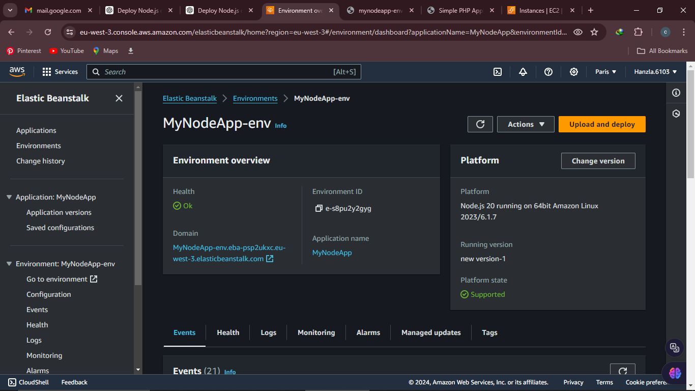
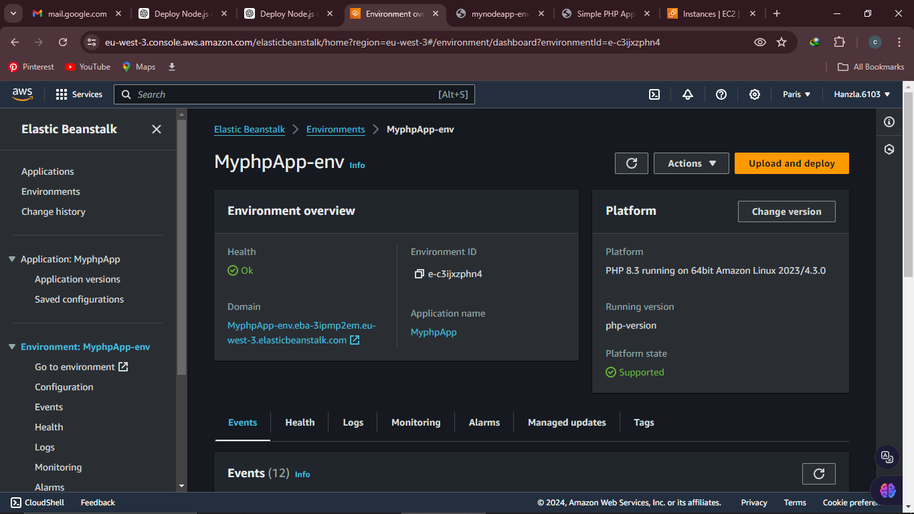

# Deploy Node.js & PHP Applications on AWS Elastic Beanstalk

> A complete step-by-step guide to deploying **Node.js** and **PHP** applications to **AWS Elastic Beanstalk**, including app creation, packaging, systemd services, and environment setup.

---

## 📋 Table of Contents

- [Overview](#overview)
- [Architecture](#architecture)
- [Prerequisites](#prerequisites)
- [Part 1: Deploy Node.js App to Elastic Beanstalk](#part-1-deploy-nodejs-app-to-elastic-beanstalk)
  - [Step 1: Prepare EC2 Instance](#step-1-prepare-ec2-instance)
  - [Step 2: Create Node.js Application](#step-2-create-nodejs-application)
  - [Step 3: Create index.js](#step-3-create-indexjs)
  - [Step 4: Update package.json](#step-4-update-packagejson)
  - [Step 5: Create Systemd Service](#step-5-create-systemd-service)
  - [Step 6: Zip Application for Beanstalk](#step-6-zip-application-for-beanstalk)
  - [Step 7: Deploy to AWS Elastic Beanstalk](#step-7-deploy-to-aws-elastic-beanstalk)
- [Part 2: Deploy PHP App to Elastic Beanstalk](#part-2-deploy-php-app-to-elastic-beanstalk)
  - [Step 1: Install Apache & PHP](#step-1-install-apache--php)
  - [Step 2: Create PHP Application](#step-2-create-php-application)
  - [Step 3: Fix Permissions](#step-3-fix-permissions)
  - [Step 4: Create PHP Systemd Service](#step-4-create-php-systemd-service)
  - [Step 5: Deploy PHP App to Elastic Beanstalk](#step-5-deploy-php-app-to-elastic-beanstalk)
- [Verification](#verification)
- [Troubleshooting](#troubleshooting)
- [Best Practices](#best-practices)

---

## Overview

This guide walks you through deploying both **Node.js** and **PHP** applications to AWS Elastic Beanstalk. You will:

✔ Build apps on Ubuntu  
✔ Create systemd services  
✔ Zip & upload application bundles  
✔ Deploy them on Elastic Beanstalk environments  

---

## Architecture

```
Local Ubuntu Instance → Zip Deployment Package → AWS Elastic Beanstalk → Load Balancer → Public URL
```

---

## Prerequisites

- AWS Account  
- Elastic Beanstalk permissions  
- EC2 Instance (Ubuntu)  
- Node.js & PHP knowledge  
- SSH access  

---

# Part 1: Deploy Node.js App to Elastic Beanstalk

---

## Step 1: Prepare EC2 Instance

Create an Ubuntu EC2 instance and allow:

| Type | Port | Source |
|------|------|--------|
| SSH | 22 | Your IP |
| Custom TCP | 3000 | 0.0.0.0/0 |

Update the system:

```bash
sudo apt update
sudo apt upgrade -y
```

Install Node.js & npm:

```bash
sudo apt install nodejs npm -y
```

---

## Step 2: Create Node.js Application

Create project folder:

```bash
mkdir my-node-app
cd my-node-app
```

Initialize project:

```bash
sudo npm init -y
sudo npm install express
```

---

## Step 3: Create index.js

```bash
sudo nano index.js
```

Paste:

```javascript
const express = require('express');
const app = express();
const port = 3000;

app.get('/', (req, res) => {
  res.send('Hello World!');
});

app.listen(port, () => {
  console.log(`App running at http://localhost:${port}`);
});
```

---

## Step 4: Update package.json

```bash
sudo nano package.json
```

Paste:

```json
{
  "name": "my-node-app",
  "version": "1.0.0",
  "main": "app.js",
  "scripts": {
    "start": "node app.js"
  },
  "dependencies": {}
}
```

---

## Step 5: Create Systemd Service

```bash
sudo nano /etc/systemd/system/my-node-app.service
```

Paste:

```ini
[Unit]
Description=My Node.js Application
After=network.target

[Service]
ExecStart=/usr/bin/node /home/ubuntu/my-node-app/app.js
Restart=on-failure
User=ubuntu
Group=ubuntu
Environment=PORT=3000
WorkingDirectory=/home/ubuntu/my-node-app

[Install]
WantedBy=multi-user.target
```

Enable service:

```bash
sudo systemctl daemon-reload
sudo systemctl start my-node-app
sudo systemctl enable my-node-app
sudo systemctl status my-node-app
```

---

## Step 6: Zip Application for Beanstalk

Inside the folder:

```bash
sudo zip -r my-node-app.zip .
```

Download zip locally:

```bash
scp -i Downloads/bean.pem ubuntu@<EC2-IP>:/home/ubuntu/my-node-app/my-node-app.zip .
```

---

## Step 7: Deploy to AWS Elastic Beanstalk

1. Go to **Elastic Beanstalk Console**
2. Click **Create Application**
3. Select:
   - **Web Server Environment**
   - **Platform: Node.js**
   - **Upload Code → my-node-app.zip**
4. Create environment
5. Access URL from Beanstalk output

---

# Part 2: Deploy PHP App to Elastic Beanstalk

---

## Step 1: Install Apache & PHP

```bash
sudo apt update
sudo apt upgrade -y
sudo apt install apache2 php libapache2-mod-php -y
```

---

## Step 2: Create PHP Application

```bash
cd /var/www/html
sudo nano index.php
```

Paste:

```php
<!DOCTYPE html>
<html>
<head>
    <title>Simple PHP Application</title>
</head>
<body>
    <h1>Welcome to My Simple PHP Application</h1>
    <p><?php echo "Hello, World!"; ?></p>
    <p><?php echo "Today is " . date("Y-m-d H:i:s"); ?></p>
</body>
</html>
```

Update Apache config (optional):

```
<IfModule mod_dir.c>
    DirectoryIndex index.php index.html index.cgi index.pl index.xhtml index.htm
</IfModule>
```

---

## Step 3: Fix Permissions

```bash
sudo chown -R www-data:www-data /var/www/html
sudo chmod -R 755 /var/www/html
```

Test in browser:

```
http://EC2-IP/index.php
```

---

## Step 4: Create PHP Systemd Service

Remove old Node.js service if needed:

```bash
sudo rm /etc/systemd/system/my-node-app.service
```

Create PHP service:

```bash
sudo nano /etc/systemd/system/php-app.service
```

Paste:

```ini
[Unit]
Description=PHP CLI Application
After=network.target

[Service]
ExecStart=/usr/bin/php /var/www/html/index.php
WorkingDirectory=/var/www/html
Restart=always
User=www-data
Group=www-data
StandardOutput=append:/var/log/php-app.log
StandardError=append:/var/log/php-app.err

[Install]
WantedBy=multi-user.target
```

Enable PHP service:

```bash
sudo systemctl daemon-reload
sudo systemctl enable php-app.service
sudo systemctl start php-app.service
sudo systemctl status php-app.service
```

---

## Step 5: Deploy PHP App to Elastic Beanstalk

1. Go to AWS Elastic Beanstalk
2. **Create New App**
3. Create environment → **Web server**
4. Select **Platform: PHP**
5. Upload your zipped PHP folder  
   Example: zip `/var/www/html` directory

After creation, access URL provided by Beanstalk.

---

# Verification

### Node.js Verification
```
Node.js App URL from Beanstalk
```

### PHP Verification
```
PHP App URL from Beanstalk
```

### Check services on EC2:

```bash
sudo systemctl status my-node-app
sudo systemctl status php-app
```

---

# Troubleshooting

### Blank Page on Node.js
- Ensure `app.js` or `index.js` exists
- Check logs:
```bash
sudo journalctl -u my-node-app -f
```

### PHP Errors
Check logs:

```bash
cat /var/log/php-app.log
```

### Beanstalk Deployment Failed
- Check logs in **Logs → Request Logs**
- Ensure zip file has correct structure (no nested folders)

---

# Best Practices

✔ Always use environment variables  
✔ Use Nginx reverse proxy for Node.js in production  
✔ Use Elastic Beanstalk `.ebextensions` for custom configs  
✔ Use separate environments for dev/staging/prod  
✔ Use IAM roles instead of storing credentials  

---

# 🎉 Deployment Complete!

You have successfully deployed:

- A **Node.js** application to Elastic Beanstalk  
- A **PHP** application to Elastic Beanstalk  
- With systemd services and proper packaging  

---

**Author:** Your Name  
**Repository:** Your GitHub Repo Link  

